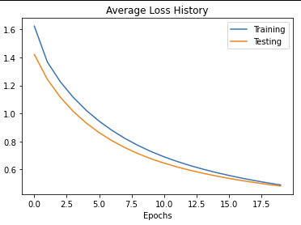

# Report

## 1(a)

### Default Parameters

* Epochs: 100
* Learning rate: 1e-3
* Batch size: 200
* Network layers: `[784, 2048, 512, 10]`
* Activation functions: `[ReLU, ReLU, Softmax]`
* Loss funciton: Cross entropy
* Weight initializer: Xavier Normal (He) initializer

### Results

| | |
|:--:|:--:|
|  |  |

Final epoch data: Train loss: 0.0735, Train acc: 98.22%, Test loss: 0.0889, Test acc: 97.76%

## 1(b)

### Small Batch Size

* Batch size: 10
* Epochs: 5

| Iteration | Epoch |
|:--:|:--:|
|  |  |
|  |  |

Elapsed time: 00:13:05

Last 5 epochs data:
```
Epoch   1: Train loss: 3.8085, Train acc: 93.00%, Test loss: 1.9922, Test acc: 96.42%
Epoch   2: Train loss: 1.4207, Train acc: 97.32%, Test loss: 1.2871, Test acc: 97.47%
Epoch   3: Train loss: 1.0014, Train acc: 97.93%, Test loss: 0.9866, Test acc: 98.18%
Epoch   4: Train loss: 0.7930, Train acc: 98.49%, Test loss: 0.8125, Test acc: 98.64%
Epoch   5: Train loss: 0.6595, Train acc: 98.73%, Test loss: 0.6950, Test acc: 98.78%
```

### Large Batch Size

* Batch size: 1000
* Epochs: 20

| Iteration | Epoch |
|:--:|:--:|
|  |  |
|  |  |

Elapsed time: 00:03:09

Last 5 epochs data:
```
Epoch  16: Train loss: 0.5592, Train acc: 92.45%, Test loss: 0.5364, Test acc: 88.16%
Epoch  17: Train loss: 0.5385, Train acc: 92.81%, Test loss: 0.5197, Test acc: 88.56%
Epoch  18: Train loss: 0.5196, Train acc: 93.06%, Test loss: 0.5044, Test acc: 89.04%
Epoch  19: Train loss: 0.5023, Train acc: 93.29%, Test loss: 0.4904, Test acc: 89.56%
Epoch  20: Train loss: 0.4865, Train acc: 93.47%, Test loss: 0.4776, Test acc: 89.80%
```

### Discussion

Although we can achieve high accuracy with just 1 epoch, training multiple epochs with small batch sizes is very slow, and could lead to overfitting problems.

Whereas training with large batch sizes, although has low accuracy during the early stages, can yeild acceptable results in a significantly shorter amount of time, and lessens the probability of overfitting. 

## 1(c)

The training epochs below have been set to 200.

### Random Initialization

Uniformly distributed random values between (-1, 1) 

Initialization code: 

```python
for _, dims in enumerate(nn_list):
    w = rand(dims[1], dims[0])*2 - 1
    weight.append(w)
```

| | |
|:--:|:--:|
|  |  |

Last 5 epochs data:
```
Epoch 196: Train loss: 0.0000, Train acc: 100.00%, Test loss: 0.3384, Test acc: 98.86%
Epoch 197: Train loss: 0.0000, Train acc: 100.00%, Test loss: 0.3384, Test acc: 98.86%
Epoch 198: Train loss: 0.0000, Train acc: 100.00%, Test loss: 0.3384, Test acc: 98.86%
Epoch 199: Train loss: 0.0000, Train acc: 100.00%, Test loss: 0.3384, Test acc: 98.86%
Epoch 200: Train loss: 0.0000, Train acc: 100.00%, Test loss: 0.3384, Test acc: 98.86%
```


### Zero Initialization

Initial weight values all set to 0

| | |
|:--:|:--:|
|  |  |

Due to Loss not showing any sign of decreasing, training was cut at epoch #10

Final epoch data: Train loss: 1.7918, Train acc: 16.67%, Test loss: 1.7918, Test acc: 18.86%

### Xavier Normal Initialization

Also known as **Glorot Normal** or **He Initialization**

Normal distributed random values with mean 0 and standard deviation

$$ \sigma = \sqrt{\frac{2}{n_{in} + n_{out}}} $$

where $n_{in}$ is the number of input nodes, and $n_{out}$ is the number of output nodes in the weight matrix

Initialization code:

```python
for _, dims in enumerate(nn_list):
    std = np.sqrt(2.0 / (dims[0] + dims[1]))
    w = randn(dims[1], dims[0]) * std
    weight.append(w)
```

| | |
|:---:|:---:|
|   |  |


Last 5 epochs data:
```
Epoch 196: Train loss: 0.0331, Train acc: 99.46%, Test loss: 0.0439, Test acc: 99.25%
Epoch 197: Train loss: 0.0329, Train acc: 99.46%, Test loss: 0.0437, Test acc: 99.26%
Epoch 198: Train loss: 0.0328, Train acc: 99.47%, Test loss: 0.0436, Test acc: 99.26%
Epoch 199: Train loss: 0.0326, Train acc: 99.47%, Test loss: 0.0434, Test acc: 99.26%
Epoch 200: Train loss: 0.0324, Train acc: 99.47%, Test loss: 0.0432, Test acc: 99.26%
```

### Discussion

From this formula for deriving the weight values:

$$ 
\frac{\partial J}{\partial w^{(L)}_{jk}} = \frac{\partial z^{(L)}_j}{\partial w^{(L)}_{jk}} \frac{\partial a^{(L)}_j}{\partial z^{(L)}_j} \frac{\partial J}{\partial a^{(L)}_j} 
$$

we can get:

$$
\frac{\partial J}{\partial w^{(L)}_{jk}} = a^{(L-1)}_k \sigma'(z^{(L)}_j) \frac{\partial J}{\partial a^{(L)}_j}
$$

where:

$$
\frac{\partial J}{\partial a^{(L)}_j} = \sum^{n_{L+1}-1}_{j=0}\frac{\partial z^{(L+1)}_j}{\partial a^{(L)}_{j}} \frac{\partial a^{(L+1)}_j}{\partial z^{(L+1)}_j}\frac{\partial J}{\partial a^{(L+1)}_j} = \sum^{n_{L+1}-1}_{j=0} w^{(L+1)}_{jk}\sigma'(z^{(L+1)}_j)\frac{\partial J}{\partial a^{(L+1)}_j}
$$

or in this case at the last layer with Cross Entropy and Softmax:

$$
\sigma'(z^{(last)})\frac{\partial J}{\partial a^{(last)}} = \hat{y} - y
$$

For **weights with initial values of 0**, the partial derivative $\frac{\partial z_j^{L+1}}{\partial a_j^{L}} = w^{(L+1)}_{jk} = 0$

Therefore, the neural network is unable to update its parameters during back propagation. Thus, the Loss and Accuracy will always be stuck around the same values.

After changing the initial weight values to **uniform random distribution**, the partial derivatives are able to back propagate, thus the neural network is able to update its parameters and improve the accuracy.

However, we can see that during training, the training loss has reached 0 and the testing loss is not able to converge any further, which is not ideal. By initializing the weights with **Xavier Normal Initialization**, we can see that the training loss and testing loss converges together, which may yeild better accuracy with testing data over time.

Reference: [Understanding the difficulty of training deep feedforward neural networks, Xavier Glorot, Yoshua Bengio ; PMLR 9:249–256](http://proceedings.mlr.press/v9/glorot10a/glorot10a.pdf)
